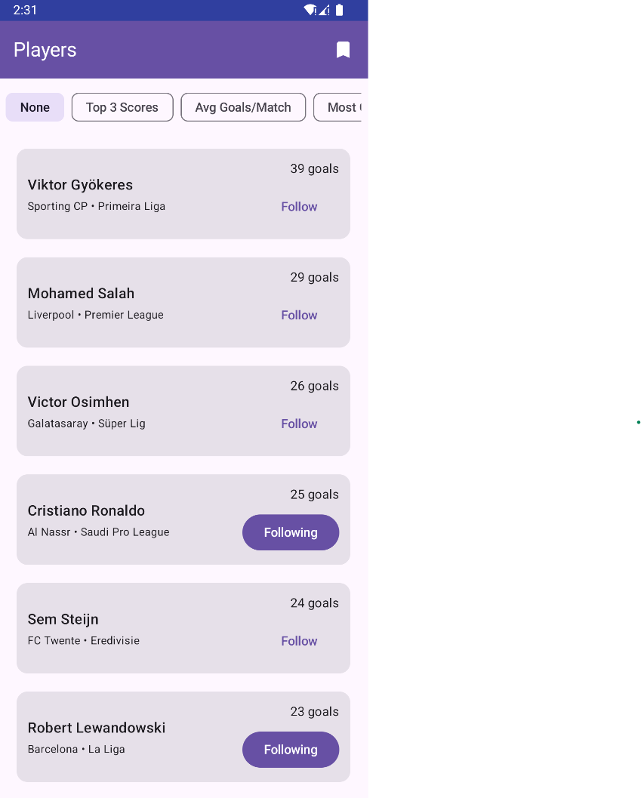
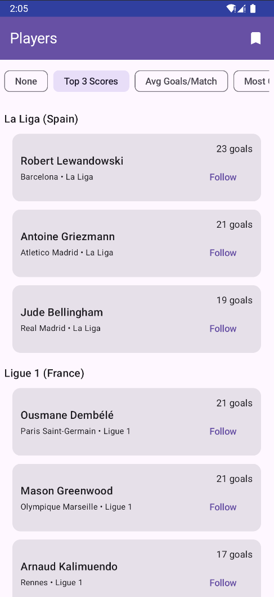
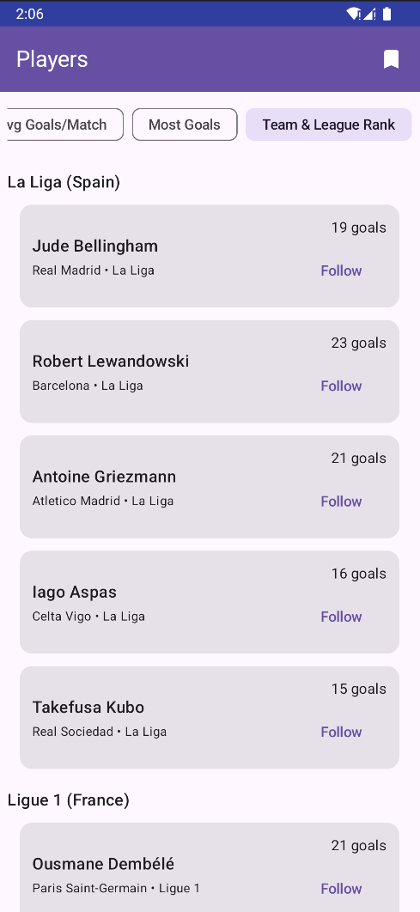

# Android Assignment

## Screenshots

  
  
  

---

#### 📝 Task Descriptionk

**Core Requirements:**

1. Display a list of players

- Player data must be displayed using pagination. ✅
- Sorting should be applied across the entire dataset, not just the current page. ✅
- The method of implementing pagination and sorting — and how they interact — is completely up to
  you. ✅

2. Follow / Unfollow players

- The user must be able to follow or unfollow any player. ✅
- Followed players should be persisted locally, so the follow status remains after closing and
  reopening the app. ✅
- How you model and store this state is entirely your decision. ✅

3. Followed players screen

- The user must be able to view their followed players in a dedicated screen. ✅
- How this screen is accessed is also up to you ( Access it via click on Bookmark icon). ✅

#### 🔧 Technical Requirements

- Use Jetpack Compose for UI. ✅

- Follow Clean Architecture principles with clear separation of layers (Presentation / Domain / Data).  ✅

- Implement Unit Tests for key components.✅ (just for GetPlayersPagerUseCase to show I'm familiar with test concepts)

- Implement UI Tests for important user flows. ❌ 

- Additional technical decisions. ✅

- Final UI/UX design is also open to your judgment. ✅

